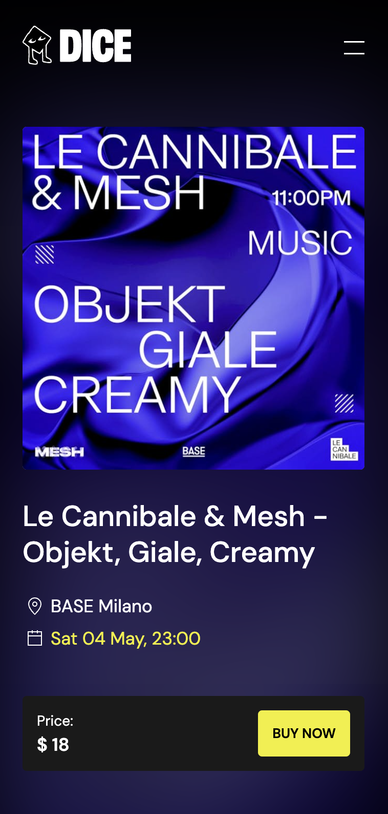

# dice

## Description

This project (copy of [dice.fm](https://dice.fm)) is a website where you can buy tickets for events. You can try it out at [https://dice-orcin.vercel.app](https://dice-orcin.vercel.app). It's obviously a demo project that's still in progress. It's meant to showcase my skills in FE development.

## Technologies

The FE is developed with Next.js using the new App Router, the event data are stored in Contentful and Stripe is used as payment service provider. The CI/CD has been done with Github pipelines.

## Next steps

1. Complete the integration with Stripe
2. Generate the tickets containing a QR code
3. Add e2e tests (using playwright)
4. Multilanguage
